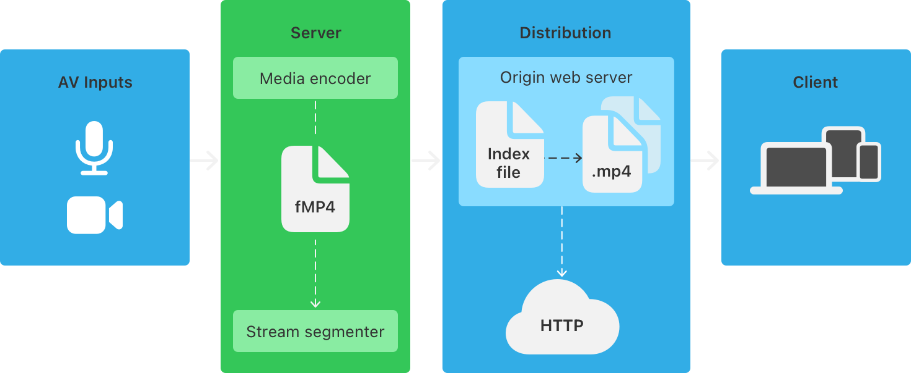
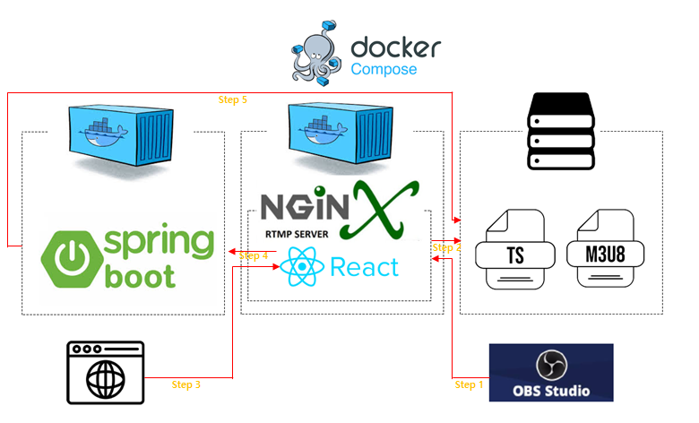
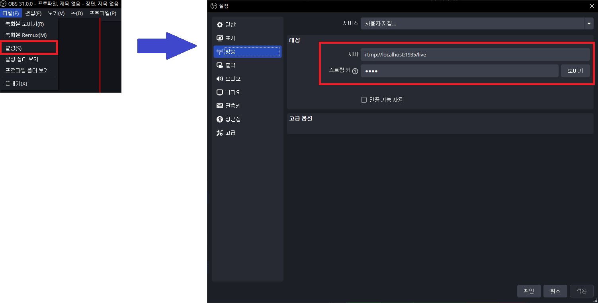

# RTMP & HLS 
- `실시간 인터넷 방송`에 사용될만한 기술 스택 RTMP 와 HLS에 대한 내용 정리 레포지토리

## 학습목표
- RTMP & HLS에 대해서 이해

## 사전학습
### 1. Codec  
- 데이터 스트림을 En/Decoding 하는 기술, 소프트웨어  
- 효율적인 데이터 전송 및 보관을 위해 데이터 열화를 감안한 손실 방식(MP3, JPEG, H.264 등)과 원본의 품질을 해치지 않기 위한 비손실 방식(FLAC, PNG, HuffYUV 등)이 있음  

### 2. MPEG(Moving Picture Experts Group)  
- ISO, IEC 산하의 멀티미디어 표준 개발 담당 그룹  
- 비디오 데이터에서 많이 사용되는 H.264(MPEG-4 AVC)와 같은 표준을 정의함  

### 3. FFMPEG  
- 비디오, 오디오의 En/Decoding, Transcoding 등 멀티미디어 파일 처리를 위한 오픈 소스 프로젝트이자 툴  
- 무료로 제공되며 멀티 플랫폼 환경에서 이용 가능

## RTMP란?
### 4. RTMP (Real Time Message Protocol)  
- 2009년 발표된 Adobe Flash에 이용하기 위한 오디오, 비디오 데이터 실시간 통신 프로토콜  
- TCP/IP 기반이며 많은 스트리밍 서비스에서 라이브 서비스를 위해 이용되고 있음  
- 2020년 Adobe Flash가 공식 지원 종료되며 직접 이용자에게 데이터를 전달하는 용도로는 사용되지 않는 추세  

## HLS란?
### 5. HLS(HTTP Live Streaming)  
  
- 2009년 Apple에서 발표한 HTTP 기반 적응 비트레이트 스트리밍 통신 프로토콜  
- 비디오 데이터를 `.m3u8` 확장자로 된 재생목록을 기록한 파일과 `.ts` 확장자의 여러 개의 멀티미디어 파일로 분할하여 스트리밍에 이용  
- Apple 제품에서 호환되는 유일한 스트리밍 포로토콜이며 기타 환경에서는 HLS Player를 통해 재생 가능  
- 전송에 이용할 비디오 데이터의 경우 H.264, H.265 Encoding 이용 필요 ([참조](https://www.cloudflare.com/ko-kr/learning/video/what-is-mpeg-dash/))

### 6. DASH (Dynamic Adaptive Streaming over HTTP)  
- 2014년 MPEG에서 정의한 국제 표준 HTTP 기반 적응 비트레이트 스트리밍 통신 프로토콜  
- 비디오 데이터를 `.mpd` 확장자의 스트리밍 메타데이터 파일과 여러 개의 `.m4a`, `m4v` 파일로 분할하여 스트리밍에 이용  
  (`.mpd`파일이 HLS의 `.m3u8`의 역할 / `.m4a` 파일은 AAC Codec의 음성 파일 / `m4v` 파일은 H.264 Codec의 비디오 파일)
- 국제 표준인만큼 HLS와 달리 다양한 인코딩에 대응할 수 있음  

### 7. CDN (Content Delivery Network)  
- 효율적인 컨텐츠(데이터) 전송을 위해 캐시 서버를 이용하는 기술  
- 주로 물리적으로 먼 거리의 사용자에게 서비스를 제공하기 위해 사용

## 예상 서비스 논리 구성
  
실시간 스트리밍 서비스에 필요할 것으로 예상되는 개념을 정리하여 예상해본 논리적인 서비스 구성 예상도  

Step 1. OBS프로그램을 이용하여 RTMP서버에 연결 요청 및 Stream 영상 정보를 전송한다.   
- OBS 설정  
Step 2. 영상정보를 담으면, HLS통신을 통해 해당 스토리지에 M3U9, TS형식으로 Stream 영상을 저장한다.   
Step 3. 이후 클라이언트가 웹 브라우저를 통해 프론트 서버에 접속을 한다.   
Step 4. 프론트에서 영상을 Load하기 위해서 Spring Boot 백엔드 서버에 요청하게된다.  
Step 5. 요청 받은 Spring boot 백엔드 서버는 스토리지에 저장된 M3U9, TS형식으로 Stream 영상을 프론트에게 응답을 해준다.  

## 참조
- https://github.com/HashCitrine/testLiveVideoStreamingService
